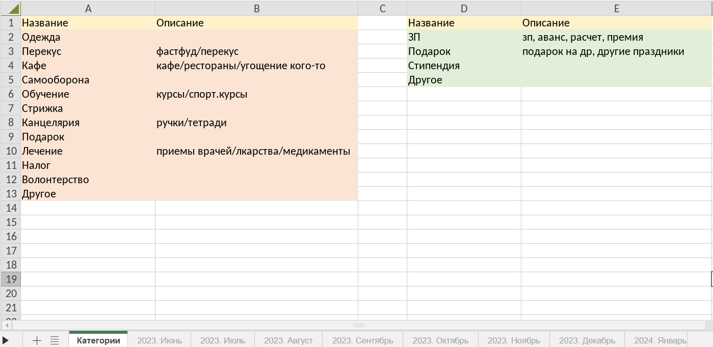

# Приложение для ведения финансов
## Описание

### Предыстория
Это приложение создано для собственного использования. 
Я веду свои финансы (доходы и расходы) через Яндекс Таблицы.
Для каждого месяца я создаю отдельную таблицу с названием: "Год. Месяц", например: "2023. Июнь".
В этих файлах фиксированный шаблон: 

Расстояние между колонками дохода и расхода не важны. В дальнейшем используются колонки "Название" и "Цена".
Пример заполненной таблицы:

Колонка "Название" используется для общего обозначения транзакции.

### Потребность
Это обычный пример того, как я веду свои финансы (данные в примере придуманы).

Цель: после работы программы должна создаваться таблица со статистикой за каждый месяц.
Под статистикой за месяц подразумевается:
1. Считать доход/расход за месяц, дельту за месяц. 
   Также указывать баланс карты на начало и конец месяца.
2. Строить графики по доходу и расходу, разбив его на категории (колонка "Название")

Итог:

Конечно, эту статистику можно сделать и "руками" через Excel,
но создавать ее каждый раз мне лень.

### Категории
Спустя полгода работы приложения появилось желание, чтобы у каждой
категории (колонка "Название") был свой цвет при построении графика 
(биекция: Категория -> Цвет). Для этого я создал новую таблицу
"Категории". В ней указал все категории, которые использую:

Слева записаны расходы, справа -- доходы. 
Теперь в колонке "Название" можно указывать только те категории, которые 
записаны здесь

### Добавить данные
Если Вы хотите использовать это приложение для себя, то Вам нужно:

1. Использовать [REST API Яндекс Диска](https://yandex.ru/dev/disk/rest/) для получения [OAuth токена](https://yandex.ru/dev/disk/api/concepts/quickstart.html#quickstart__oauth)
2. Следовать инструкциям выше (в том числе, разрешить доступ к данным для чтения и записи на Яндекс Диск)
и получить токен
3. Добавить файл **config.py** в корневую папку проекта (на уровне **settings.py**)
4. Создать в нем переменную **TOKEN** и вставить Ваш токен авторизации
5. Создать переменную **YADISK_PATH_TO_DATA** и указать путь до Вашего файла с финансами на Диске
6. Создать таблицу "Категории" в Яндекс Таблицах и записать свои категории по 
аналогии с картинкой

**ВАЖНО:** во время работы приложения файл с финансами должен быть закрыт

### Кастомизация
Если Вам не нравятся цвета, которые используя я и Вы хотите использовать свои, то для этого Вам нужно:
1. Открыть файл **settings.py** и найти переменную **COLORS**
2. Создать свою подборку цветов в 16-формате. Как вариант, можно воспользоваться
[этим сайтом](https://www.rapidtables.org/ru/web/color/RGB_Color.html)
3. Записать их в список **COLORS** (без хэштега #) вместо моих
4. Первой категории в Вашей таблице "Категории" будет соответствовать первый
   цвет в списке **COLORS**, второй категории -- второй цвет и т.д. Если цветов
   в списке окажется меньше чем категорий, то цвета начнут повторяться
   
   
## Используемые технологии
1. yadisk - для работы с Яндекс Диском
2. pandas - для парсинга excel-таблицы
3. openpyxl - для работы с excel-таблицой (статистика, графики)
