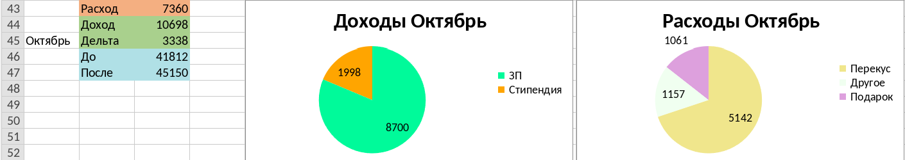

# Приложение для ведения финансов
## Описание

### Предыстория
Это приложение создано для собственного использования. 
Я веду свои финансы (доходы и расходы) через Яндекс Таблицы.
Для каждого месяца я создаю отдельную таблицу с названием: "Год. Месяц", например: "2023. Июнь".
В этом файле фиксированный шаблон: 

Расстояние между колонками дохода и расхода не важны. В дальнейшем используются колонки "Название" и "Цена".
Пример заполненной таблицы:

Колонка "Название" используется для общего обозначения транзакции.

### Потребность
Это обычный пример того, как я веду свои финансы (данные в примере придуманы).

Цель: после работы программы должна создаваться таблица со статистикой за каждый месяц.
Под статистикой за месяц подразумевается:
1. Считать доход/расход за месяц, дельту за месяц
2. Рисовать график по доходу, разбив его на категории (колонка "Название")
3. Аналогично с расходами

Итог:

Конечно, эту статистику можно сделать и "руками", но делать ее каждый раз мне лень.

### Добавить данные
Если Вы хотите использовать это приложение для себя, то Вам нужно:

1. Использовать [REST API Яндекс Диска](https://yandex.ru/dev/disk/rest/) для получения [OAuth токена](https://yandex.ru/dev/disk/api/concepts/quickstart.html#quickstart__oauth)
2. Следовать инструкциям выше (разрешить доступ к данным для чтения и записи на Яндекс Диск)
и получить токен

3. Добавить файл **config.py** в корневую папку проекта (на уровне settings.py)
4. Создать в нем переменную **TOKEN** и вставить Ваш токен авторизации
5. Создать переменную **YADISK_PATH_TO_DATA** и указать путь до Вашего файла с финансами на Диске

**ВАЖНО:** во время работы приложения файл с финансами должен быть закрыт

## Используемые технологии
1. yadisk - для работы с Яндекс Диском
2. pandas - для парсинга exel-таблицы
3. openpyxl - для работы с exel-таблицой (статистика, графики)
